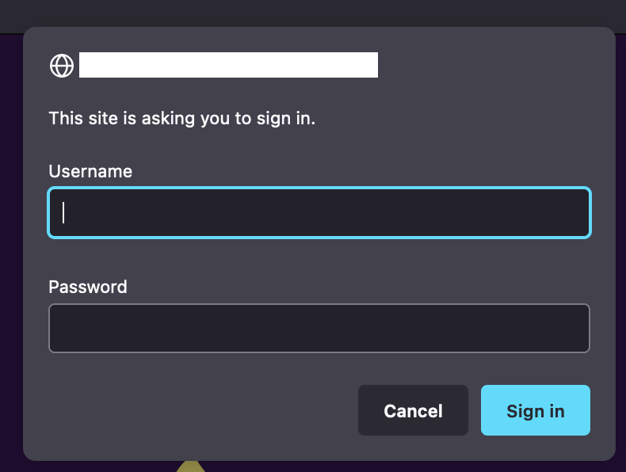

# LDAP Auth Proxy for Kubernetes Ingress

LDAP Auth Proxy is a Flask based proxy that provide LDAP based authentication for Kubernetes ingress resources.

LDAP Auth Proxy provides authentication for your apps running on Kubernetes.

## Requirements

-   Kubernetes version >= 1.20
-   [Ingress NGINX Controller](https://github.com/kubernetes/ingress-nginx) installed

## How It Works

The Ingress NGINX Controller support External Basic Authentication by setting `nginx.ingress.kubernetes.io/auth-url` annotation (See [Docs](https://kubernetes.github.io/ingress-nginx/examples/auth/external-auth/)). The LDAP Auth Proxy serves as an external Basic Auth provider. It proxies Baisc Auth requests to an external/in-cluster LDAP Server and verifies if the user has access to certain resources according to pre-defined rules.

## Usage

### Deploy the LDAP Auth Proxy Pod

First, clone this repository to a machine that has `kubectl` configured.

```shell
git clone https://github.com/davidliyutong/ldap-proxy
cd ldap-proxy
```

The `deploy/deployment.yaml` can be used to deploy LDAP Auth Proxy to Kubernetes cluster. During deployment, the LDAP credentials are passed to the proxy container as environment variables, which should be modified according to your LDAP server configuration:

| Name               | Description                         | Example                                 |
| ------------------ | ----------------------------------- | --------------------------------------- |
| LDAP_HOST          | URI of the LDAP server              | `ldap://ldap.default.svc.cluster.local` |
| LDAP_PORT          | LDAP server port                    | `389`                                   |
| LDAP_BASE_DN       | LDAP Base DN                        | `dc=example,dc=com`                     |
| LDAP_BIND_USER     | The user that has search privillege | `cn=admin,dc=example,dc=com`            |
| LDAP_BIND_PASSWORD | Password of the bind user           | `-`                                     |
| LDAP_USER_DN       | Valid user DN pattern               | `uid={},ou=users,dc=example,dc=com`     |
| LDAP_SEARCH_DN     | Search filter                       | `(uid={})`                              |

```yaml
env:
    - name: LDAP_HOST
      value: "ldap://<LDAP_SERVER>.<NAMESPACE>.svc.cluster.local" # Or ldaps://
    - name: LDAP_PORT
      value: "389" # Or 646 if using LDAPS protocal
    - name: LDAP_BASE_DN
      value: "dc=example,dc=com"
    - name: LDAP_BIND_USER
      value: "cn=admin,dc=example,dc=com"
    - name: LDAP_BIND_PASSWORD
      value: "<PASSWORD>" # Bind password for LDAP_BIND_USER
    - name: LDAP_USER_DN
      value: uid={},ou=users,dc=example,dc=com # '{}' will be replaced by username
    - name: LDAP_SEARCH_DN
      value: (uid={}) # '{}' will be replaced by username
```

Apply `deploy/deployment.yaml` with `kubectl` to an namespace.

```shell
kubectl apply -f deploy/deployment.yaml -n <NAMESPACE>
```

The pod should appear very soon.

### Tag Ingress Resouces

The Ingress Resource should have `nginx.ingress.kubernetes.io/auth-url` annotaed, according to official document.

```shell
kubectl annotate ingress <YOUR_INGRESS_RESOURCE> nginx.ingress.kubernetes.io/auth-url=http://ldap-proxy.<NAMESPACE>.svc.cluster.local/auth/ldap
```

```yaml
apiVersion: networking.k8s.io/v1
kind: Ingress
metadata:
    annotations:
        nginx.ingress.kubernetes.io/auth-url: http://ldap-proxy.<NAMESPACE>.svc.cluster.local/auth/ldap
```

The ingress resouces now requires authentication.



## Deployment

The docker image is built with folowing command.

```shell
docker build -t ldap-proxy .
```

Only `src/app.py` is need for LDAP Auth Proxy to work. It depends on `flask`, `ldap3` and `flask-httpauth`.

## Security Notice

This is a toy project under rapid developement. Do not use it for production.

When using basic auth username and password will be transfered in plain text if TLS is not enabled for target ingress resource.

## Acknowledgement

This project is inspired by [this blog](https://zhuanlan.zhihu.com/p/377931297)
